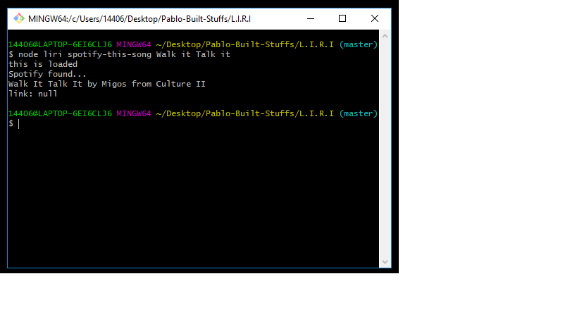
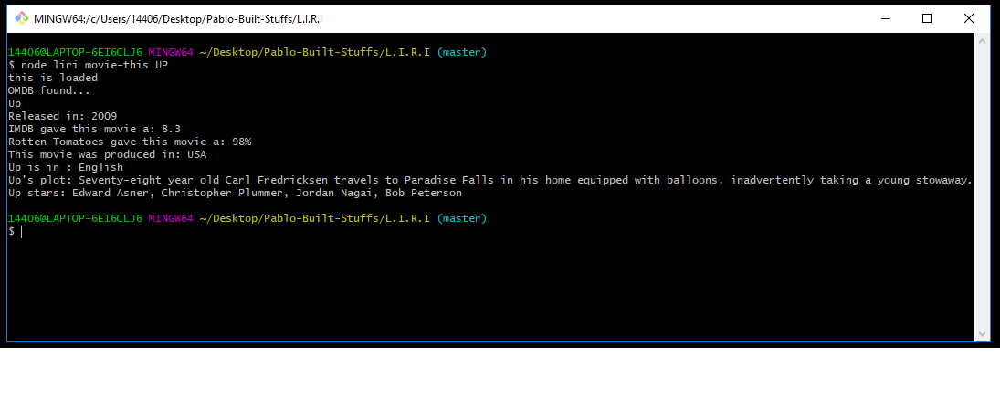
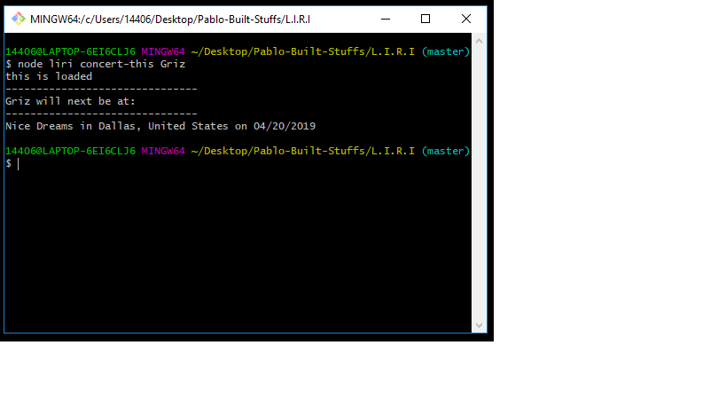

# L.I.R.I
**L**anguage **I**nterpretation & **R**ecognition **I**nterface, or LIRI is a Node Application capable of giving you information on movies, concerts, or songs!

## What Can I Search For?
LIRI is capable of...

    - Searching BandsInTown for concerts by a specific artist.

    - Searching Spotify for info about a specific song.

    - Searching OMDB for info about a specific movie.

    - do-what-it-says....see what happens...
### What Do I Need?
In order to use the L.I.R.I. app you will need the following...

    -Node.js 

    -Command Line Interface of some sort (CLI)

You will also need to install these node packages, all of which are included in the package file, which is fairly straight forward.

Navigate to your LIRI folder in your CLI and run the command...

    -npm install

this will automatically download all neccessary packages.

#### How Does L.I.R.I Work?
L.I.R.I. uses very specific syntax in tandem with user input to deliver the information you want.

The commands and their syntax are as follows...

    - node liri spotify-this-song <song name>

    - node liri movie-this <movie name>

    - node liri concert-this < artist/band name>

